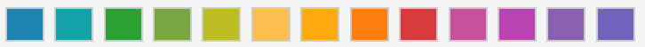

# Redmine Reports

Simple bar chart reports of issues

   

The Redmine Reports plugin is a Redmine plugin. It slightly modifies Redmine default report diagram to show vertical bar diagrams and a pleasant color scheme.

---


> :exclamation: The color scheme has changed with version 0.2.z! Stay on version 0.1.z when the old color scheme as shown below integrates better in your theme.



## Installation

> :warning: **Don't clone the default branch**: For production you need to clone the **_master_** branch explicitly!

```shell

git clone -b master https://github.com/xmera-circle/plugin_name

```

You need a running Redmine instance in order to install the plugin. If you need help with the installation, please refer to [Redmine.org](https://redmine.org).

Instructions for the installation of this plugin can be found in the [official documentation](https://circle.xmera.de/projects/redmine-reports/wiki) on
[xmera Circle - the community website of xmera](https://circle.xmera.de).

## Changelog

All notable changes to this plugin will be reported in the [changelog](https://circle.xmera.de/projects/redmine-reports/repository/redmine_reports/entry/CHANGELOG.md).

## Maintainer

This project is maintained by xmera Solutions GmbH.

## Context Information

This plugin is part of a plugin selection aiming to provide the information security management system solution xmera Omnia.

All plugins in the selection are compatible with [Redmine 4](https://redmine.org).

More information about xmera Omnia can be found at [xmera](https://xmera.de).

## Support

For any question on the usage of this plugin please use the [xmera Circle » Community Portal](https://circle.xmera.de). If you found a problem with the software, please create an issue on [xmera Circle](https://circle.xmera.de) or [GitHub](https://github.com/xmera-circle/redmine_reports).

If you are a xmera Solutions customer you may alternatively forward your issue to the xmera Service Customer Portal.

## Security

xmera Solutions takes the security of our software products seriously. 

If you believe you have found a security vulnerability in any xmera Solutions-owned repository, please report it to us as described in the [SECURITY.md](/SECURITY.md).

## Code of Conduct

We pledge to act and interact in ways that contribute to an open, welcoming, diverse, inclusive, and healthy community. 

Please read our [Code of Conduct](https://circle.xmera.de/projects/contributors-guide/wiki/Code-of-conduct) to make sure that you agree to follow it.

## Contributing

Your contributions are highly appreciated. There are plenty ways [how you can help](https://circle.xmera.de/projects/contributors-guide/wiki).

In case you like to improve the code, please create a pull request on GitHub. Bigger changes need to be discussed on [xmera Circle » Community Portal](https://circle.xmera.de) first.

## License

Copyright (C) 2021-2023 Liane Hampe (<liaham@xmera.de>), xmera Solutions GmbH.

This plugin program is free software; you can redistribute it and/or
modify it under the terms of the GNU General Public License
as published by the Free Software Foundation; either version 2
of the License, or (at your option) any later version.

This program is distributed in the hope that it will be useful,
but WITHOUT ANY WARRANTY; without even the implied warranty of
MERCHANTABILITY or FITNESS FOR A PARTICULAR PURPOSE.  See the
[GNU General Public License](https://www.gnu.org/licenses/old-licenses/gpl-2.0.en.html) for more details.
